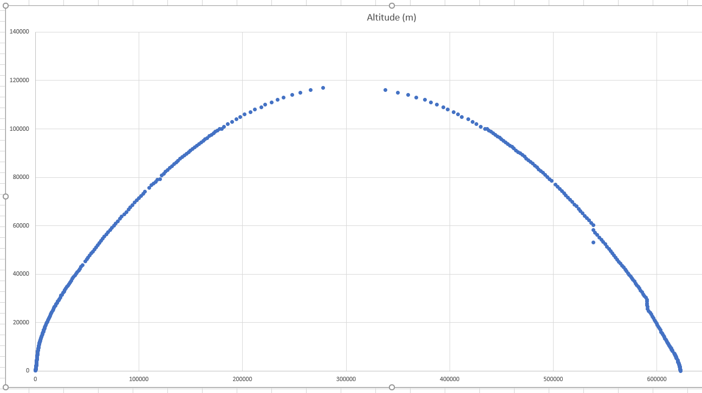

# SpaceX launch tracking

Idea: convert the telemetry info in the SpaceX launch videos into a visual
gravity turn/launch profile.

### **NOTE:** This is just a WIP idea and nothing in here is promised to work for you

Immediately obvious TODOs:
 * Detect and track stage 2.
 * Output to console if redirecting to a file.

## Source video

You could use `youtube-dl` to get https://www.youtube.com/watch?v=QJXxVtp3KqI,
downloading to an mp4.

I don't know if that's legal where you are so I'll leave that bit up to you.

## Generating data

### Install

Firstly, Tesseract: https://github.com/tesseract-ocr/tesseract

Then with Python 3.9.

    pipenv install

### Run

    pipenv run python generate.py [seconds where telem appears] [seconds where separation happens] [video path]

Example:

    pipenv run python generate.py 1192 1368 "GPS III Space Vehicle 05 Mission-QJXxVtp3KqI.mp4"

### The data

The data is CSV data of elapsed time (in seconds), estimated distance
downrange (in metres) and altitude (in metres).

The distance downrange is calculated over these steps:
 * When the altitude changes, we know how long it was since the last time, how far vertically we have travelled, and can also know the velocity at this point in time, and the previous time the altitude changes. This gives a change in velocity over a time.
 * The change in velocity can give us an average velocity (this bit is wobbly and I need to work on it).
 * The change in altitude tells us a distance straight up. The average velocity over time gives us a distance actually travelled. Knowing the two distances we can use Pythagoras to work out the downrange distance.
 * Accumulating these downrange distances and plotting against altitude gives us a flight profile.

## Examples

### 1 FPS sample rate, just stage 1

